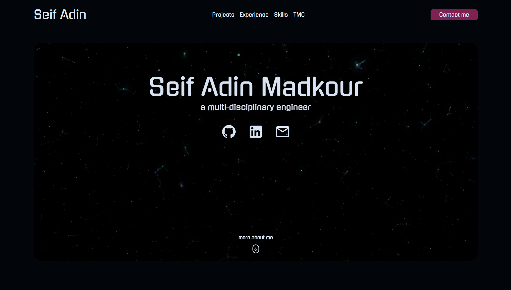

# The Seif Adin Portfolio

This project changed a lot for me, let me tell you how.

A few months ago, while I was building a certain project; I noticed that I had an issue when it came to the UI design part, so I tried to fix it.

I started as usual by trying to find a course or a tutorial about ui design, but after jumping from one place to the other; I figured that ui design is better learnt by doing.

I decided to design my own portfolio, which was an idea that I always tried to escape from, because I always thought about it as if it's supposed to be perfect, but I started anyway.

First I looked into a couple of portfolios, figured what I liked and what I didn't, and started designing it the way I liked, step by step until I got the look that I liked, then I started writing the code for it.

Now this is my portfolio; up and alive, and I am really proud of it, cause I didn't just identify a problem I had, didn't just solve it, but I did it the way I liked; that's why it means so much for me.

You can see the live version here [Live](https://seif-adin-madkour.vercel.app)

You can see the code here: [Github](https://github.com/Sam50x/portfolio)
